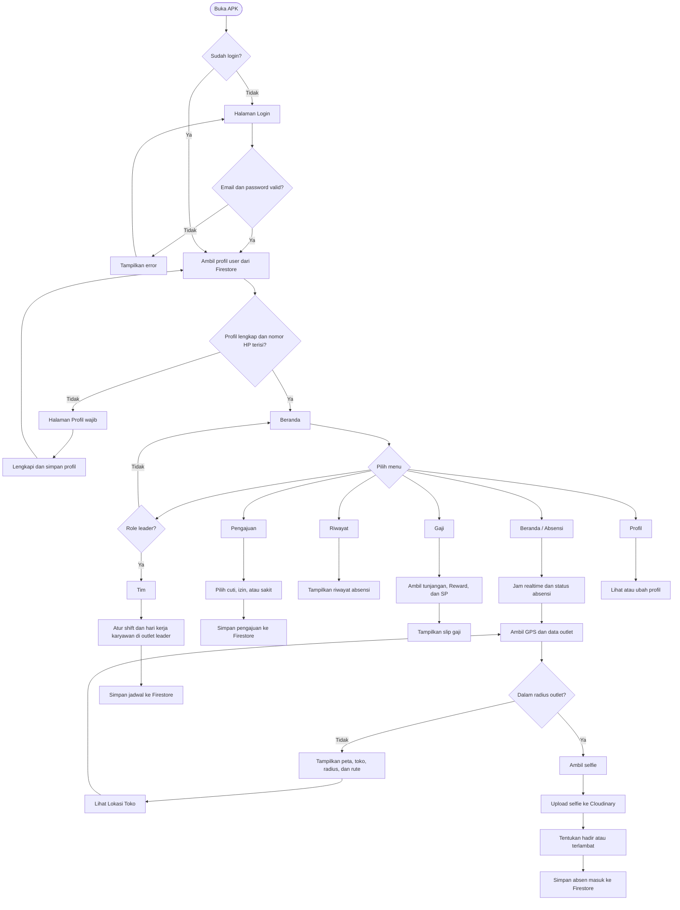
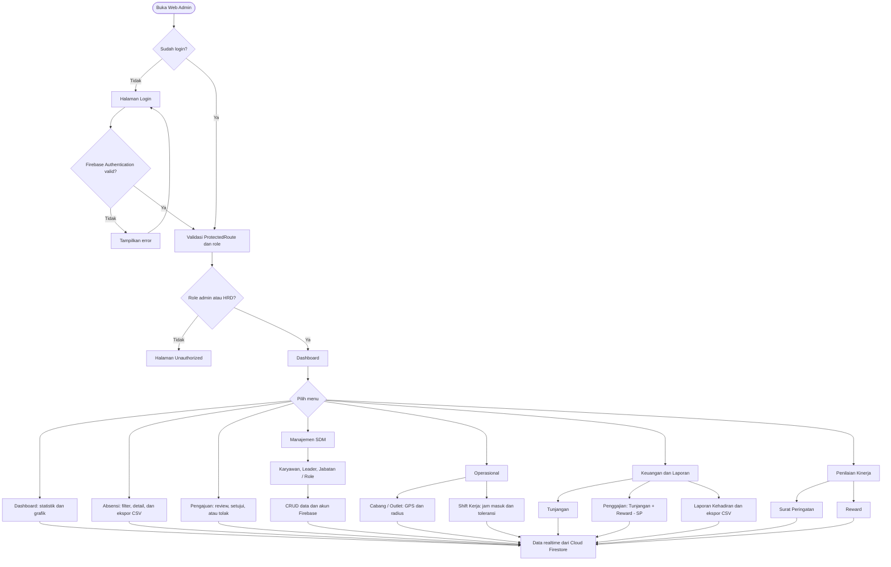

# Flowchart Sistem Golqi Absensi

## 1. Flowchart APK Karyawan dan Leader

## 2. Flowchart Web Admin dan HRD

Buka file ini di VS Code lalu tekan `Ctrl+Shift+V` untuk melihat diagram. GitHub juga dapat merender Mermaid secara otomatis.
